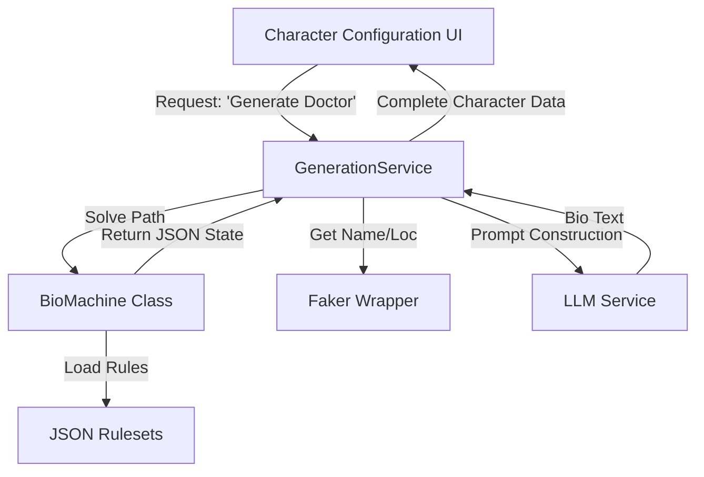

# CR005: Character Generation Enhancements

## 1. Overview
Enhance the character generation process by integrating a "Bi-Directional Procedural Character Bio Generator" and realistic data generation using `faker`. This system will allow users to generate coherent, narratively rich character backgrounds based on logical constraints (e.g., "Must be a Doctor") or purely random weighted probabilities.

## 2. System Architecture

The solution will be implemented as a standalone service layer that the front-end components consume.

### 2.1 The Bio Generator Engine ("BioMachine")
A standalone TypeScript service implementing the 3-layer architecture defined in the specialized HLD.

*   **Layer 1: The Spine (Logic)**: A Constraint Satisfaction Engine to determine the valid life path (Origin -> Education -> Career).
*   **Layer 2: The Flesh (Simulation)**: A probabilistic event simulator that adds "color" events (accidents, windfalls) based on tags from Layer 1.
*   **Layer 3: The Skin (Narrative)**: An LLM prompt interface that converts the structured event data into a written biography.

### 2.2 The Data Generator (Faker Wrapper)
A lightweight utility service wrapping `faker` to provide locale-specific data.

*   **Inputs**: Country of Origin (Locale).
*   **Outputs**: First Name, Last Name, Location (City/Region).

### 2.3 Architecture Diagram



## 3. Data Structures

### 3.1 Bio Engine Data (JSON)
We will maintain the strict schema definitions from the imported design.

*   **Nodes**: `EventNode` (Origin, Education, Career).
*   **Events**: `LifeEvent` (Parallel events).
*   **Tags**: String identifiers for state (e.g., `WEALTHY`, `DEGREE_MEDICAL`).

```typescript
// Core Data Node
interface EventNode {
  id: string;
  slot: 'ORIGIN' | 'CHILDHOOD' | 'EDUCATION' | 'CAREER';
  requires?: string[]; // Tags needed to enter
  provides?: string[]; // Tags granted
  weights: { [tag: string]: number; "DEFAULT": number };
}

// Bi-Directional Request
interface BioGenerationRequest {
  targetCareer?: string; // Pinning constraint
  targetOrigin?: string; // Pinning constraint
  age?: number;
}
```

### 3.2 Faker Data
*   **Supported Locales**: Map simplified country names to Faker locales (e.g., "USA" -> `en_US`, "Japan" -> `ja`).

## 4. Implementation Plan

### Phase 1: Foundation & Dependencies
1.  **Dependencies**: Install `faker` (or `@faker-js/faker`).
2.  **Directory Structure**: Create `src/lib/generator/` for the new engine.
3.  **Data Ingestion**: Create `src/lib/generator/data/` and populate `origins.json`, `education.json`, `careers.json`, `events.json` with initial robust datasets (as per Appendix of imported HLD).

### Phase 2: The Faker Service
1.  Implement `src/lib/generator/NameGenerator.ts`.
2.  Expose method `generateIdentity(countryCode: string)`.

### Phase 3: The BioMachine (Logic Layer)
1.  Implement `BioMachine.ts`.
2.  **Method**: `solveSpine(constraints: BioGenerationRequest)`: implements the Backward/Forward propagation logic.
3.  **Method**: `simulateFlesh(spine: EventNode[])`: implementation of the age-loop and parallel event injection.

### Phase 4: Integration - "The Skin" & UI
1.  **LLM Service**: Connect `BioMachine` output to `generate-bio` API endpoint.
2.  **UI Update**: Modify `character-configuration.tsx`:
    *   Add "Country" dropdown.
    *   Add "Generate Name" button (calls Faker).
    *   Add "Generate Bio" section:
        *   "Random" vs "Custom" toggle.
        *   If "Custom": Dropdowns for Target Career / Origin (driven by available JSON data).
        *   "Generate" button triggers the `BioMachine` -> LLM pipeline.
    *   Populate the `description` and `first_mes` fields with the result.

### Phase 5: Verification
1.  Unit tests for `BioMachine` logic (ensure "Surgeon" always has "Medical Degree").
2.  End-to-end test of UI generation flow.
